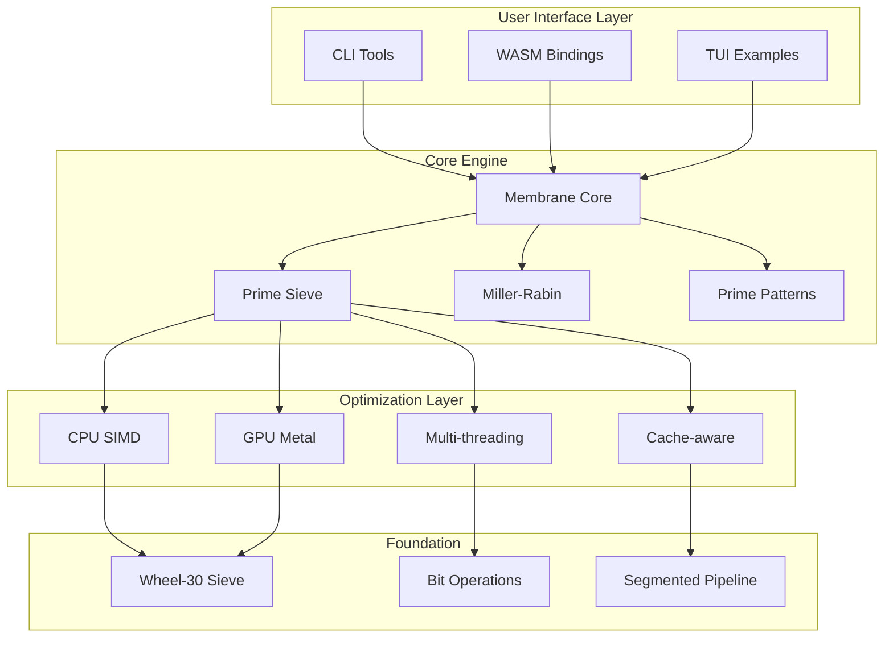

# Architecture Overview

The Prime Physics Engine is designed for maximum performance and flexibility in prime number generation using membrane physics patterns.

## System Architecture



## Core Components

### 1. Membrane Core (`src/membrane/`)
The heart of the engine - implements symmetric membrane number construction with configurable parameters.

**Key Features:**
- Symmetric pattern generation
- Base-agnostic design
- Zero-padding control
- Coprimality validation

### 2. Prime Sieve (`src/prime_sieve.rs`)
High-performance sieving with multiple optimization strategies.

**Pipeline:**
```
Input Range → Wheel-30 Filter → Segmented Sieve → Bit Packing → Output
     ↓              ↓                   ↓              ↓
  (limit)     (skip 77%)         (L1 cache)      (8x density)
```

### 3. GPU Acceleration (`src/gpu.rs`, `src/metal_host.rs`)
Metal shader pipeline for massive parallelization.

**Data Flow:**
```
Candidates → Pack to GPU → Metal Kernel → Unpack Results → CPU Verify
    ↓            ↓              ↓              ↓              ↓
 (millions)  (4x uint32)   (SIMD groups)   (bitmask)    (Miller-Rabin)
```

## Memory Hierarchy

### Cache-Aware Design
```
L1 Cache (32KB)
├── Segment size: 32KB for optimal hit rate
├── Sequential access patterns
└── Bit-packed data structures

L2 Cache (256KB) 
├── Base primes storage
├── Lookup tables
└── Working segments

L3 Cache (8MB)
├── Full sieve for small ranges
└── GPU transfer buffers

RAM
├── Large prime storage
└── Results accumulation
```

## Performance Optimizations

### 1. SIMD Utilization
- AVX2/AVX-512 on x86_64
- NEON on ARM64
- Packed bit operations

### 2. Parallel Strategies
```rust
// CPU Parallelism
Rayon::par_iter()
  .chunks(cache_line_size)
  .map(|chunk| process_segment(chunk))
  .collect()

// GPU Parallelism  
Metal::dispatch_threads(
  thread_groups: candidate_count / 256,
  threads_per_group: 256
)
```

### 3. Memory Access Patterns
- **Sequential**: Sieve marking (99% cache hits)
- **Strided**: Wheel factorization (predictable)
- **Random**: Final verification (minimized)

## Module Organization

```
prime-physics-engine/
├── src/
│   ├── lib.rs              # Public API
│   ├── membrane/           # Membrane pattern generation
│   │   ├── mod.rs         # Core logic
│   │   ├── config.rs      # Configuration
│   │   └── builder.rs     # Builder pattern
│   ├── prime_sieve.rs      # Sieving algorithms
│   ├── miller_rabin.rs     # Primality testing
│   ├── gpu.rs              # GPU abstraction
│   ├── metal_host.rs       # Metal implementation
│   └── performance.rs      # Performance utilities
├── shaders/                # Metal shaders
├── examples/               # Usage examples
└── benches/               # Benchmarks
```

## Data Flow Example

### Membrane Prime Generation
```
1. User Input
   MembraneConfig { base: 6, outer: 1, inner: 5, k_outer: 0, k_inner: 0 }
   
2. Pattern Construction
   outer + k_zeros + inner + k_zeros + middle + mirror → 15051
   
3. Primality Pipeline
   Quick filters → Trial division → Miller-Rabin → Confirmed prime
   
4. Result
   Prime { value: 15051, config: {...}, generation_time: 0.3ms }
```

## Platform-Specific Paths

### macOS (Metal)
```
Application → Metal API → GPU Compiler → Kernel Execution → Results
```

### Linux/Windows (CPU)
```
Application → SIMD Detection → Optimized Path → Parallel Execution → Results
```

### WebAssembly
```
JavaScript → WASM Module → Sandboxed Execution → BigInt Results → UI
```

## Future Architecture Plans

1. **Vulkan/WebGPU Support**: Cross-platform GPU acceleration
2. **Distributed Computing**: Network-based prime search
3. **Hardware Acceleration**: FPGA implementations
4. **Quantum Integration**: Hybrid classical-quantum algorithms

## Security Considerations

- Input validation at all entry points
- Bounds checking in unsafe code blocks  
- Resource limits for DoS prevention
- Sandboxed execution in WASM

---

For implementation details, see the source code documentation.
For performance tuning, see [PERFORMANCE.md](technical/PERFORMANCE.md).